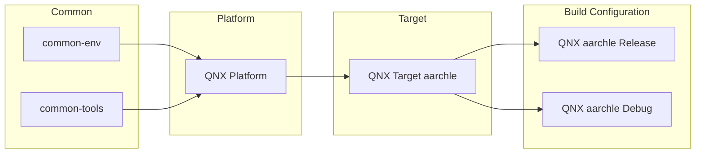

# Conan Profiles

Conan profiles in this repository are defined for different configuration layers, and are composited together into a complete build configuration profile.

These layers include:
1. Common configuration
2. Platform configuration
3. Target configuration
4. Build configuration

Additionally there are profiles providing common configuration for build tools, but these are not included in the build configuration since the build tools can vary across projects.

# Configuration Composition

# Common Configuration
**Name Format:** `common-<>`

Example: [common-env](profiles/common-env)

Covers general configuration that can apply to everything.

# Platform Configuration
**Name Format:** `<platform_name>`

Example: [qnx](profiles/qnx)

Covers settings that can apply to all builds for the platform for any target. For example, platform specific compiler flags that should always be used.

# Target Configuration
**Name Format:** `<arch>-(<platform>)-<os>-<compiler>`

Note: Not every configuration has a platform.

Example: [aarch64le-qnx-neutrino-qcc8.3](profiles/aarch64le-qnx-neutrino-qcc8.3)

Covers settings that can apply to all builds of a target for any build configuration. Configuration such as architecture, OS, and target compiler flags are defined here.

# Build Configuration
**Name Format:** `<target_configuration_name>-<build_type>`

Example: [aarch64le-qnx-neutrino-qcc8.3-release](profiles/aarch64le-qnx-neutrino-qcc8.3-release)

Covers settings specific to this build configuration. For example the build type (Release, Debug), debug flags, optimization flags, etc.

# Tool Profiles
Tools are configured in this repository two different ways.

First a conan profile for the tool should be defined in profiles/tools folder. A specific version of the tool should be chosen and any configuration for the tool to be used should be defined in the profile.

A project may reference these tool profiles to add the tools they need to build. However they may also choose to specify the tool requires within their recipe.

The second configuration is to define `[replace_tool_requires]` in [profiles/common-tools](profiles/common-tools) to override the tool version in the conan recipe with the one we intend to use.
